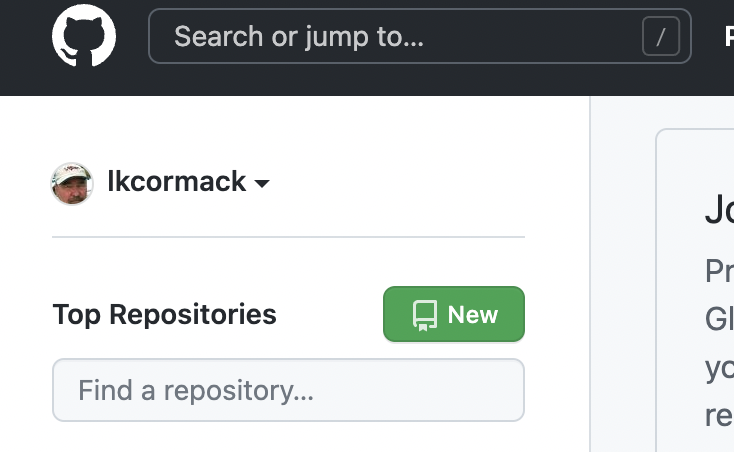

# git / GitHub exercise

## Create a new repo on GitHub
Go to your home on GitHub and click the "New" button in the left sidebar.

Note, it is possible to make a new repo on your local machine and then "reverse clone" it to GitHub. It is easier to go in the other direction, however.

If you have a project that you've been working on outside of git/GitHub, the easiest thing to do is create an empty repo, copy or move your existing files into the repo folder, and then `git add` them to the repo.

## Clone it to your local machine 

Navigate to where you want the repo on your local machine.

For example:
`git clone https://github.com/lkcormack/tempTest`
