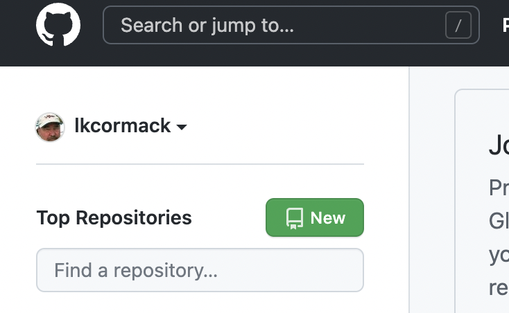

# git / GitHub exercise

The following exercise will warm up our git/GitHub muscles, and remind us of the most commonly used things we do when using git and GitHub to make sure our projects and their history are safely backed up.

## Create a new repo on GitHub
Go to your home on GitHub and click the "New" button in the left sidebar.



Note, it is possible to make a new repo on your local machine and then "reverse clone" it to GitHub. It is easier to go in the other direction, however, cloning a GitHub repo to your local machine.

If you have a project that you've been working on outside of git/GitHub, the easiest thing to do is create an empty repo, copy or move your existing files into the repo folder, and then `git add` them to the repo.

## Clone it to your local machine 

Navigate to where you want the repo on your local machine, and then clone it.

For example, I named my repo "tempTest", so I moved to my GitHub directory:

`cd /Documents/GitHub`

And then cloned my new repo:

`git clone https://github.com/lkcormack/tempTest`

After doing the analogous steps on your computer, you'll have a new local copy of your new GitHub repo.

## Check your work

Do a quick 

`git status`

It should say something like 

> On branch main. 

> Your branch is up to date with 'origin/main'.

## Change an existing file locally and push
Make a change to your README.md file. Use any text editor\* you like. Just make sure it stays a plain text file.

Do a `git status` again. The output should include "modified: README.md".

Now make a commit for your changed README file:

`git commit -a -m "added to README"`

Do another `git status` - it should tell you that your branch is ahead of 'origin/main' by one commit (meaning there is one commit - the change you made - in your local repo that isn't present on GitHub). It will also suggest you do a `push`.

So let's get origin/main up to date by doing the suggested push:

`git push origin`

Now go to the "remote" copy of your repo on GitHub (refresh the browser tab if it's already open). Your README.md file should reflect the changes you made!

The above example shows our basic work flow for editing files and using GitHub as a backup service. If anything were to happen to your laptop, all  would not be lost because all of your work (including the history of changes) is safely stored on GitHub's servers, and can be accessed from any computer.

## Add a new file locally and push
Create a new file in your repo called "fortytwo.py" containing the python code
```
ans = 42
print(f"{ans} is the answer!")
```
(and save it of course)

Can we do a `git push origin` right now and update our GitHub repo?     


 No, we can't. We have to tell git that we want to track our new file by adding it. Do a quick `git status` to confirm this.

Let's add the file to our repo:  
`git add fortytwo.py`

Do another quick `git status` to see what's up. (There is absolutely no harm in doing a quick status checks a *lot*!!!)

Now we can commit, and then push up to GitHub repo!  
` git commit -a -m "Adding a short Python program"`

(optional) `git status`

`git push origin`

Now you can go to GitHub, refresh your browser tab, and see that our little Python program has been added to the GitHub repo!

## A brief aside about text files
Many of the files we deal with as coders / data scientists are plain text files. 

You might think that all plain text files end with a .txt extension. Some do, but the .txt extension is merely a way to tell both the computer and computer users that "this is *just* a file complaining plain text - nothing more". 

In reality, many of the files we deal with are plain text files also. The file I'm working on now - GitGitHubExercise.md - is a plain text file. It has the .md extension to tell me, you, other people, the operating system, and other applications that the text inside is in *markdown* syntax, and can be treated as such. Same with .py files, .R files, etc. These are just plain text files, but the extensions tell the world that they contain Python code, R code, etc.

The nice thing about having these all be plain text files is that you can quickly edit them in ***anything***. You can use anything from a terminal based editors like nano or vi to bare bones GUI text editors like cotEditor or textEdit to Microsoft Word or Google Docs. If you use something like the latter two, however, make sure you save them out as ***plain text***, not .docx or whatever!


## Change a file on GitHub and fetch
Create a new file on GitHub using Add File -> Create new file. I made a new file called "fileOnGitHub.py" that contained the code `print("I'm a new file created on GitHub!")` but you can do whatever you wish!

Now let's fetch the changes from our local terminal using `git fetch`.

Fetch is the safe way to get changes from GitHub, because no changes are made to *your* actual files (you can confirm this with an `ls`. Unfortunately, the output of fetch isn't particularly helpful. But we can see what's been changed by looking at the log, like this:

`git log --oneline origin `

The `--oneline` argument just keeps the output mercifully short. If you look at the top line of the log, you can see that we've created a new file on GitHub. In my case:

`(base) $ git log --oneline origin                                         20:45
2e89271 (origin/main, origin/HEAD) Create fileOnGitHub.py`

That looks good - nothing looks like it's going to destroy my local repo, so lets incorporate - "merge" - the changes!

`git merge origin`

Viola! Now you have the new file (again, you can confirm this with an `ls`), and your local repo is now in sync with the "origin" version on GitHub!


## Change a file on GitHub and pull
Using `git fetch` and `git merge` is considered the safe way to update your local repo with any changes made to the origin (i.e. the GitHub repo). Using `git pull origin` is the "dangerous" way to sync your local repo with the version on GitHub. It is used when you are ***absolutely sure*** that the version on GitHub is what you want. It doesn't ask you any questions or tell you anything, it just incorporates any changes on the origin into your local branch.

To see this, create another new file on the GitHub version of your repo, just like you did above. (I made a file called "yetAnotherFileOnGitHub.py".)

Once you've created another new file, go back to your terminal and type   

`git pull origin`

After that, do an `ls`, and you'll see that your new file has been immediately added to your local repo.

## footnote
\* The some versions of Linux, including the Mac OS, come with a terminal based text editor called "nano" that is easy to use and great for quick simple edits. I love it.   

To edit an existing file using nano, just type `nano <existing filename>` at the terminal. To create a new file and edit it, type `touch <new filename>` to create the file, and then `nano <new filename>` to edit it.  

There is also a long-running, famous, and ubiquitous text editor called "vi" that has evolved into "vim" that you should at least know about if you want data science street cred. Type `vi` or `vim` at the terminal to get started.