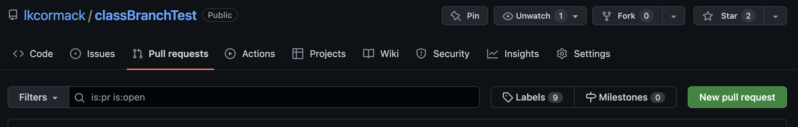

# git / GitHub branching exercise

## Branches
Branches are a way to safely work on your code (or someone else's) without risking breaking anything.

When you make a branch and start working on it, you working on *copies* of your stuff without messing up the current (presumably working) versions. Once you have added whatever new stuff you want to your code, debugged it, and verified that's working the way you want, then you can *merge* your changes back into the main code.

### Make a new repo on GitHub
This is just for the class exercise, so you can name it anything you want. I named mine "classBranchTest".

Select the box for adding a README file (you should aways have a README file in my opinion). Notice that near the bottom it says

>This will set  main as the default branch. Change the default name in your settings.

So this means that, even though we have not manually created any branches yet, we already have a "branch" called "main". You can actually change the name to anything you want, but "main" is good. You can think of this main branch as the "trunk". 

As the name suggest, this is the functioning, most-polished, bug-free version of your code - the "production" version if you will. It's the version of your project that you would show off to friends and family, and it is also the version that you want to make sure and *not* mess up!

### Add a file
In your new repo, hit the "Add file" button and select "Create new file". Notice that right where you name the file, GitHub tells you that it is creating file in the "main" branch. See Figure 1.

As you can see, I added a new markdown (.md) file and added a line to it.

When you scroll down to save your new file, notice that it gives you a couple options (See Figure 2):

The default option is to commit the file to the main branch - the commit is just like doing a commit from the command line on a local repo - it makes the file an official member of the repo (and note that GitHub has generated a commit message for you, which you can change if you wish).

The other option, "create a new branch for this commit and start a pull request", is actually a short-hand version of what we will be doing today. This option comes in handy when you are working with someone else and you're adding a file that you want them to take a look at before anointing it an official member of the repo.

Keep the default option and save the file.

We now have new repo with one branch in it - the "main" branch - that has two files in it (the README and the one you just created).

### Clone the repo to your local machine
You know how to do this! Open a terminal in (or navigate a terminal to) your GitHub folder, and get gitting:

`git clone https://github.com/...` (where the rest of the address is the path to your new repo on GitHub of course.

We now have both a remote (GitHub) and a local version of our repo, each of which has one branch - main - with two files in it. Let's look at the new local version (`cd` into the new repo).

Let's look at the files:

`ls -a` (the "-a" shows all files and directories, including hidden ones)

This should show us that we have 1) the README file, 2) the other file we made, and 3) the magic .git folder, which tells us that the folder is also an official get repo.

Now let's check the branches on our local repo. There should be only one, "main", but let's confirm:

`git branch`

### Make a new branch

We can make a new branch like this:  
`git switch -c <new_branch_name>`  

The `-c` means **c**reate a new branch, so the whole command is can be thought of as "Create a new branch called <new_branch_name> and switch to it".

(You can also use `get checkout -b <new_branch_name>`, but that's old-school.)

So let's make a new branch called "tempBranch":

`git switch -c tempBranch`

Let's 

`git branch` to verify! 

You should now see a main branch as well as your new tempBrach, and the tempBranch should have a "*" in front of it (and may be colored) to indicate that it's the branch in which we are currently working.

### Add a file to your new branch

Make a new file in the repo directory however you want. You can do this easily in the terminal like this:

`touch myFirstLocalFile.md` (create a file - name yours whatever)
`nano myFirstLocalFile.md` (edit the file in nano)

Add some text and save the file.

Don't forget to add the file to your repo! 

`git add -A` add all files

or 

`git add <yourFileName>` add a specific file 

And then do a commit.

### Push your new branch to GitHub

We can now push our new branch up to GitHub! We can't just do a `git push` however, because GitHub doesn't know about our new branch yet. We have to use arguments to `push` to tell it to set up an "upstream" version on GitHub. Like this:

`git push --set-upstream origin tempbranch`

This pushes your new brach (mine being called "tempbrach") and makes it the "upstream" version tagged as origin. So, from now on, when you want to push, you can just 

`git push` 

or 

`git push origin`

### Check your repo on GitHub
If you now go to GitHub (and maybe refresh the tab), you'll see a nice message something like in Figure 3.

So GitHub is telling you that the branch on GitHub has been updated recently, and asking you whether you want to create a "pull request".

(If you don't see the message, don't panic. Just verify that your new branch is there, and then move on to pull requests.

### Pull requests

What are "pull requests"? Why can't I just push my changes to the main branch?

Remember that the two main purposes of branches are to

    * allow for collaboration
    * make it hard for you to mess up the main branch
    
To do this, GitHub doesn't allow you to simply push changes into the main branch. Rather, you create a "pull request". The pull request tells everybody in the project (just you, in this case) that you have made changes that you think are good, and would like them to be pulled into the main branch. 

### Making our pull request

There are a few ways to make pull requests. One way is to go to the "Pull requests" tab on your repo page, and hit the big green "New pull request" button on the far right (See Figure 4).

### Accepting the pull request and merging the changes

Everybody on the project now has a chance to look at the changes and discuss them. Once it's agreed the that changes are good to go and should be pulled in, it's time to merge!

Once you hit that button, you'll be given a chance to specify what you want pulled into what (See Figure 5).

The main branch will already be selected as the base branch, and you should select your new branch as the comparison branch. After this, you just keep hitting the big green buttons... you'll be asked to

* View the pull request
* Merge the pull request and, finally, 
* Confirm the merge

Why all the steps? Because the main branch is considered sacred! It's the copy of your stuff that you absolutely positively don't want to mess up! That's why GitHub wants to make extra-super-sure that you want to change it.

Once you confirm the merge, you'll be greeted with the message (See Figure 6):

### Deleting the temporary branch

Now that you've made your changes and merged them into the main branch, we can delete our temporary branch. 

As you can see, once you confirm the merge, GitHub gives you a button to delete GitHub's copy of the temporary branch. Hit the delete button, and you're done on GitHub.

Now, we just have to remove the temporary branch on our computer - the local version. (We actually don't *have* to, but just like doing dishes or cleaning your room, there are things you don't **have** to do, but you really should do...)

Pop back into the terminal on your GitHub repo. You can delete the your temporary branch with:

`git branch -d tempbranch` 

(remember, I named my branch "tempbrach", and the `-d` is for "delete")

But, if you are still working in your temporary branch (if you have it "checked out"), you need to switch back to the main branch before you can delete:

`git switch main`

And now you can delete the temporary branch.

`git branch -d tempbranch` 

## Summary

Today, we learned how to safely make changes to a project. To do this, we 

    * make a new temporary branch that will serve as our "scratch paper"
    * switch to the temporary branch
    * make changes to the temporary branch
    * create a pull request, which asks the main branch to please incorporate your changes
    * switch the main branch
    * merge the changes into the new branch
    
The one thing we haven't covered is how to resolve conflicts should they arise. GitHub makes this fairly easy, and we'll cover this as it comes up.

