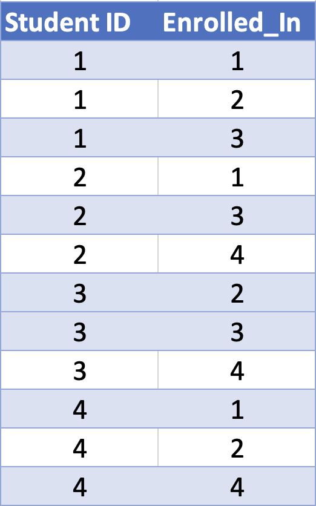
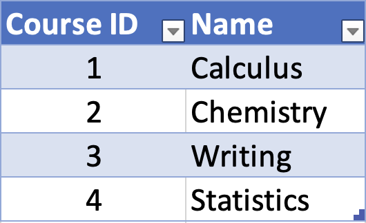
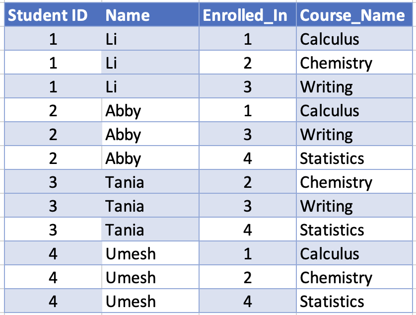

## Introduction to SQL

SQL is short for *Structured Query Language*. Developed in the 70's at IBM, SQL now generally refers to both the language itself, and the way the language expects data to be structured, which is in a *relational database*. It is very widely used in business (IBM stands for "International Business Machines" after all), and it's only a matter of time before a data scientist comes into contact with SQL in one way or another.

In Python, there are built-in data types, but these are very flexible. We can choose to store and access data however we want. NumPy and Pandas were both written by Pythonistas so they could store and access data in arrays or data frames, respectively. Moreover, anyone can, in principle, write their own storage scheme if they wish – that's the flexibility of Python!

SQL, on the other hand, is very specifically tailored to data stored in these relational data bases and, as such, is referred to as a *domain specific language*, as opposed to a *general purpose language* such as Python. So, yes, learning SQL means that we will be learning a *new programming language*, but one that's tailored to do very specific tasks on a very specific arrangement of data. 

### Relational Databases

Relational data bases are made up of "tables", which are much like data frames in R or Pandas (or tibbles, in the case of using the Tidyverse in R). Consider the following table:

We would generally refer to the rows as either "rows" or "observations". In SQL, they are referred to as "rows" or "tupples". Our "columns" or "variables" become "columns" or "attributes". The entire table is a "table" or a "relation". The terms "tupple", "attribute", and "relation" are rarely used in practice, but we should know them just in case.

This table is a "relation" because each tupple relates a student ID to a Name and vice versa. Now consider the following 2 tables as well:

Taken together, these 3 tables form a little relational database!

If we wanted to find out what courses (by name) a student was taking, we could look up their ID in the first table, then find the corresponding course IDs in the second table and, finally, look up what courses these are in the final table.

For example, if we wanted to know Tania's schedule, we could use the first table to find her ID (3). Then we could use the second table to see that the student with ID 3 is taking the courses with IDs 2, 3, and 4. Finally, we could use the last table to see that these courses are Chemistry, Writing, and Statistics.

Notice that, using the same basic procedure in reverse, we could find out which students are taking, say, Calculus (that would be Li, Abby, and Umesh).

That is fundamentally how relational databases work. Notice that each table has at least one column that corresponds to a column in at least one other table. This lets us jump from table to table to get the information we want.

That's really it! Everything else is just learning the SQL language to do things like we just did above, and understanding the particular database on which we're working.

### Relational Databases vs. Single Data Frames

You’ve probably already been thinking “Wait, couldn’t we put this all into one ‘tidy’ data frame, just like we would using R or Python/Pandas?” The answer is of course yes, and here’s such a table:

This has all the same information as in the previous 3 tables and is all in a single place. In fact, for a small dataset like this, seeing what courses Tania is taking by eye is much easier by glancing at this single data frame that using the relational database method method on the first 3 tables. 

But now consider the same sort of information for even a large high school or small university. We have many more types of information (columns), and many more items of each type. With a single data frame, anytime *anything* changed, we’d have to add or modify at least one entire row, making sure we got everything right. With the relational database method updating information is simpler. When a professor offers a new course, for example, *only the course table needs to be updated*! When a new student joins or graduates, *only the student table needs to be updated!* And when a student registers for particular classes, *only the table relating student and course IDs needs to be updated*. In short, different kinds of data are compartmentalized into different tables, making the structure of the overall data set more clear, and reducing the chances of errors when things need to be updated. 

### SQLite

SQL comes in many flavors or dialects or whatever you want to call them. Many of these are proprietary (e.g. Oracle), but SQLite is free and open source. And, if you have a Mac, it's already installed on your computer! If you are running windows, you can download it from the [SQLite homepage](https://www.sqlite.org/index.html) (make sure and download both the DLL and the command line tools).

