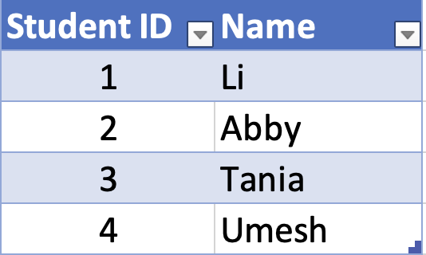

## Introduction to SQL

SQL is short for *Structured Query Language*. Developed in the 70's at IBM, SQL now generally refers to both the language itself, and the way the language expects data to be structured, which is in a **relational database**. It is very widely used in business (IBM stands for "International Business Machines" after all), and it's only a matter of time before a data scientist comes into contact with SQL in one way or another.

In Python, there are built-in data types, but these are very flexible. We can choose to store and access data however we want. NumPy and Pandas were both written by Pythonistas so they could store and access data in arrays or data frames, respectively. Moreover, anyone can, in principle, write their own storage scheme if they wish – that's the flexibility of Python!

SQL, on the other hand, is very specifically tailored to data stored in relational databases and, as such, is referred to as a *domain specific language*, as opposed to a *general purpose language* such as Python. So, yes, learning SQL means that we will be learning a *new programming language*, but one that's tailored to do very specific tasks on a very specific arrangement of data. 

### Relational Databases

When working with SQL, the data are always in the form of a relational database. Relational data bases are made up of "tables", which are much like data frames in R or Pandas (or tibbles, in the case of using the Tidyverse in R). Consider the following table, “Students”:



We would generally refer to the rows as either "rows" or "observations". In SQL, they are referred to as "rows" or "tupples". Our "columns" or "variables" become "columns" or "attributes". The entire table is a "table" or a "relation". The terms "tupple", "attribute", and "relation" are rarely used in practice, but we should know them just in case.

The Students table is a "relation" because each row relates a student ID to a Name and vice versa. 

Now consider the following 2 tables, “Enrollment” and “Courses”.


Taken together, these 3 tables form a little relational database!

If we wanted to find out what courses (by name) a student was taking, we could look up their ID in the Student table, then find the corresponding course IDs in the Enrollment table and, finally, look up what courses these are in the final “Courses” table.

For example, if we wanted to know Tania's course load, we could use the Student table to find her ID (3). Then we could use the Enrollment table to see that the student with ID 3 is taking the courses with IDs 2, 3, and 4. Finally, we could use the Courses table to see that these courses are Chemistry, Writing, and Statistics.

Notice that, using the same basic procedure in reverse, we could find out which students are taking, say, Calculus (that would be Li, Abby, and Umesh).

That is fundamentally how relational databases work. Notice that *each table has at least one column that corresponds to a column in at least one other table*. This lets us jump from table to table to get the information we want.

That's really it! Everything else is just learning the SQL language to do things like we just did above, and understanding the particular database on which we're working.

### Relational Databases vs. Single Data Frames

You’ve probably already been thinking “Wait, couldn’t we put this all into one ‘tidy’ data frame, just like we would using R or Python/Pandas?” The answer is of course yes, and here’s such a table:


This has all the same information as in the previous 3 tables and is all in a single place. In fact, for a small dataset like this, seeing what courses Tania is taking by eye is much easier by glancing at this single data frame that using the relational database method method on the first 3 tables. 

But now consider the same sort of information for a large high school or small university or a huge school such as Texas, Ohio State, or Michigan! We have many more types of information (columns), and many more items of each type. With a single data frame, anytime *anything* changes, we’d have to add or modify at least one entire row, making sure we got everything right. With the relational database method updating information is simpler. When a professor offers a new course, for example, *only the course table needs to be updated*! When a new student joins or graduates, *only the student table needs to be updated!* And when a student registers for particular classes, *only the table relating student and course IDs needs to be updated*. In short, different kinds of data are compartmentalized into different tables, making the structure of the overall data set more clear, and reducing the chances of errors when things need to be updated. 

### SQL

SQL stands for Structured Query Language. It can be pronounced “ess cue ell” or “sequel” – the latter comes from the very first version developed in the early 1970s, which was called SEQUEL, for “Structured English Query Language”. As that name suggests, SQL was designed from the start to be, like Python, very human-readable.

SQL, unlike Python, is not a general purpose programming language. Rather, SQL is a very specialized (“domain-specific”) language; its sole purpose is to allow you to access data stored in a relational database.^1^ Because SQL is meant for such a specific purpose, it is rather small. In fact, a SQL vocabulary of just two words, `SELECT` and `FROM`, will allow you to view data from a table in a database, and adding once more word, `WHERE`, will allow you to view only the rows that meet some criterion! 

As a simple example (we’ll be doing lots of hands-on SQL later), if we wanted to see the students’ names, the SQL statement would be:

```sqlite
SELECT Name
FROM Students;
```

This is meant to be like English, in that a parallel statement in plain speech might be something like “GRAB the keys FROM the kitchen counter.”

SQL is very lenient about formatting and is case-insensitive. So this will work:

```sqlite
select
name
from
students
;
```

So will this:

```sqlite
Select Name From Students;
```

The only thing SQL really insists on is correct spelling and a semicolon to terminate a statement (and commas if we’re selecting multiple things).

That having been said, best practice is to put SQL elements in all caps, and to capitalize table names and columns names as they were defined. So, of the above, the first version is best. 

But because this query is so simple,

```sqlite
SELECT Name FROM Students;
```

would also be acceptable. 

---

##### Queries

Most of what data scientists do with databases is to request some subset of data from them. These requests, in the form of SQL statements, are called ***queries***. Importantly, *queries never edit the tables in the database itself*. Queries create a new table *in memory* called a ***view***.

#####  Views

A “view” refers to a temporary table created by a query. This table is unnamed and lives in memory only. If we feel that this particular view is useful and that we’d like to have it in the future, there are 2 common things we can do:

* export the view as a .csv file
* save the “view” for later use

A potential source of confusion is that, when we save a “view”, *we save the SQL code that created the table for us*, not the table itself. So “view” can refer to either saved SQL query code that creates a “view” table, or the table itself.

---

As data scientists, getting a view out of SQL is our starting point. It gives us the data we wish to analyze. So, in order to do this, we need to get the data table represented by the “view” into a numpy array or, more commonly, a Pandas data frame. This is relatively easy because, if we can export the view as a .csv file, then we can easily import it to Pandas using `pd.read_csv()`. Furthermore, and as we will see later, we can also use SQL directly from within Python to save the results of a query straight into a Pandas data frame!

### SQLite

SQL comes in many flavors or dialects or whatever you want to call them. Many of these are proprietary (e.g. Oracle). They all share the same basic vocabulary and syntax of course so, as long as you know the basics, you’ll be able to adapt to any of the implementations.

In this class, we are going to use [SQLite](https://www.sqlite.org/index.html), which is free, open source, and, chances are, it's already installed on your computer! 

### SQLiteStudio

We are going to start learning SQL using a wonderful IDE called [SQLiteStudio](https://sqlitestudio.pl/). This will allow us to learn SQL in an environment reminiscent of RStudio or MATLAB. 

---

> Before class, install SQLiteStudio on your computer and verify that it launches successfully.

---

##### Footnote

^1^ This isn’t quite true. SQL also allows you to add, delete, and update data and even create databases from scratch. These are more advanced topics and, in fact, many databases are read-only (so you can access the data at will, but you can’t modify the database itself).


