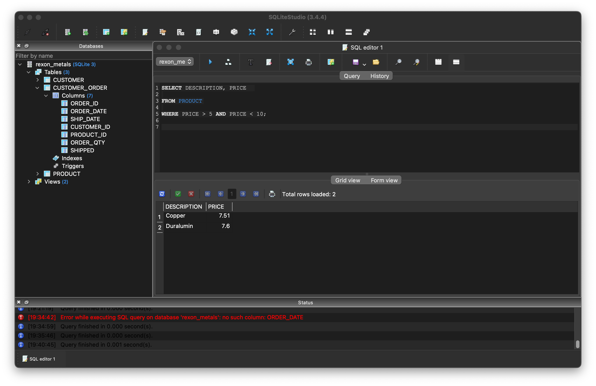

## Introduction To SQLiteStudio and SQL

If you haven’t already dowloaded and installed SQLiteStudio, do so now. Go ahead and start SQLiteStudio. 

### Tour of SQLiteStudio

SQLiteStudio is a really nice IDE (integrated development environment) for working with SQL (or, more precisely, the widely-used SQLite dialect of SQL). If you’ve used another IDE such as RStudio (or PyCharm or MATLAB), you should find it somewhat familiar.

#### Panes

This is the SQLiteStudio window.



It is divided into a few main panes. On the left is the Databases pane. It shows any databases that you have added. Yours is probably empty at the moment (we’ll fix that soon!).

 To the right of the Databases pane are two panes, an upper one that has “Query | History” at the top, and a lower one that has “Grid view | Form view” at the top. If you look closely, you’ll see that these 2 panes are actually part of a window called “SQL editor 1” that lives within the SQLiteStudio application window.

At the bottom of everything is the Status pane. It shows how long your query took to execute or an error message if there is was an error in your code when you tried to run it. If you don’t have the status pane, you can toggle it on or off under the View menu item in the top menu bar. Note that you can also toggle other things on and off and further customize your interface.

#### Accessing a database

In order to access the data in a database, we need to “add” the database and then “connect” to it. Well use this concept of establishing a connection to a database again later, when we learn to use SQL from Python. For this exercise, we’re going to use the ***rexon_metals.db*** dataset that’s in the Canvas module. As we’ll soon see for ourselves, it contains customer, order, and product information for the fictional Rexon Metals company.

##### Add a database

To add the database, you can use either the Databases menu in the menu bar, or you can hit the little “Add a database” button above the Databases pane (the little steel barrel with a green plus sign on it). Once you add the database, it will appear in your Databases pane every time you open SQLiteStudio until you remove it.

* Databases -> Add a database
* Navigate to your database file and open it

##### Connect to the database

Now it’s time to connect to the database.  This is somewhat equivalent to reading a file into Pandas (or Excel or R or whatever); it opens the file so that you can interact with it. To connect with the database, first, select it in the database pane. Then you can either hit “Connect to the database” under the Databases menu in the top menu bar, or you can hit the little “Connect to database” button just above the Databases pane (a little plug going into an extension cord).

* Select the database in the Databases pane
* Databases -> Connect to database

The database will remain connected until you disconnect it. It will remain connected even if you quit and re-start SQLiteStudio, so you can pick up working right where you left off.

##### Looking at the database structure

You can explore the structure of the database in the Databases pane. If you have successfully added and connected the rexon_metals.db file, you will see that it now has a little expand/collapse button next to it’s icon in the databases pane. If you click it, you’ll see that the database contains *Tables* and *Views.*

###### Tables

Tables contain the permanent data in the table. The data in the tables are considered sacred and, in many situations, only certain users are given permission to modify them. Regular users can look but can’t touch. The databases we’ll play with are not locked in this way but, for now, we will only query the tables, not modify them.

If you expand the Tables icon, you’ll see that this database contains 3 tables. You can further expand each table to see that it has Columns, Indexes, and Triggers. We’ll ignore the indexes and triggers for now. If you expand the Columns under any table, you can see the column names. Thus, using the Databases pane, you can get a good picture of the structure of the entire database.

###### Views (and Triggers)

Views represent subsets of the data we wish to look at. The word “View” is used to mean both

* A new table – a table in memory only – that shows you a subset of the data
* The SQL code that makes that table

If we double click the “BEHIND_SCHEDULE” view, a new window will open showing you some SQL code. If you look at the top of this window, you’ll see “Query”, “Data”, “Triggers” and “DDL” buttons, with the “Query” button highlighted. If you click the “Data” button, you’ll see the table generated by the query!

Take a minute to go back to the “Query” and see if you can generally understand what the code is doing.

Once you are finished, you can close the View window by clicking the red dot (on the View window, not the whole SQLiteStudio editor window!), or by selecting View -> Close current window from the top menu bar.

Triggers are an important part of SQL, but are beyond our scope for now. Briefly, triggers are SQL code statements that run when something happens to the database. For example, if a company goes out of business, we’d want to delete them from the CUSTOMER table and we’d probably want to delete their orders from the CUSTOMER_ORDER table. Rather than trying to keep track of what all to change when one thing changes, triggers are used to automatically do this. So, in this situation, we could have a trigger that deletes the correct rows from CUSTOMER_ORDER whenever a customer is deleted from the CUSTOMER table.


---

### Basic SQL

Because SQL is a special purpose language, its use is quite limited. Specifically, it used only to *interact with database files*. Here, “database files” does not refer to “a file that somebody called a ‘data base’ in a meeting.” or whatever, but rather a specific file type that adheres to the specifications of being an actual *database file*. For us, these will have the extension “.db” or “.sqlite”.

#### `SELECT` and `FROM`

Now that we’ve attached a database, let’s do some SQL! Let’s see what products Rexon Metals offers – you never know what you might need! 

Type this in the SQL editor pane.

```sqlite
SELECT * FROM PRODUCT;
```

and hit the “Execute query” button (the little right-pointing blue arrow).

And – poof! – the product table appears in the pane beneath the editor pane. Just like a Pandas dataframe, the table has column names across the top to label the variables, and variable values running down the rows.

In the statement above, the splat (*) is shorthand for “all the columns”. So an English version of the above query would be “Give me all the columns from the product table.” The semicolon is not actually needed in – and only in – SQLiteStudio, but *a semicolon is required to terminate a statement* in general, so it’s better to just keep in the habit of doing it.

Let’s just get a couple columns. Do do this, we just specify the column names after the select keyword (instead of the splat).

```sql
SELECT DESCRIPTION, PRICE  

FROM PRODUCT;
```

And now you should 

Take a minute to play around with the formatting in the above statement. Can you put each word on a separate line? Can you put them all on one line? What happens if you omit the comma?

---

Try this: 

* Look at the whole customer table
* Look at just the names and home states in the customer table

---

#### `WHERE`

By using the `WHERE` keyword, we can specify criteria for the rows. Like this:

```sqlite
SELECT DESCRIPTION, PRICE 
FROM PRODUCT
WHERE PRICE > 10;
```

And now you should just see the products that cost more than $10.

SQL is very tolerant about how you express numbers.

---

Try this:

* Make the 10 into a decimal number. What happens?
* Use, in turn, `ten`, `"10"`, and `“ten”`. What works and what doesn’t?

---

So it seems that, as long as a number is represented numerically (rather than in words), things work, even if the number is in quotes.

You can specify more than one logical condition for `WHERE`. 

---

Try this: See if you can get the product description and price of items that cost more than \$5 and less than \$10.

---

#### Derived Columns

You can make new columns in your view based on existing columns. For example, let’s say that sales tax is 8%. We could see how much tax would be charged for each item like this:

```sqlite
SELECT PRICE, PRICE * 0.08 AS TAX
FROM PRODUCT
```

---

Try this: Make a view that shows the price and a total price (the price plus the tax).

---

#### Exporting View Data

You can export the results of your queries to a .csv file very easily by hitting the “Export results” button just above the editor pane (it’s 4 blue arrows pointing outward). This will bring up a standard save dialog that allows you to name the file to be exported and pick it’s type (which would be .csv for reading into a Pandas dataframe). 

---

Try this: Export the data from one of the above queries, and then read it into a Pandas dataframe!

#### Saving a View

Once you have a query the way you want it, you can save it as a view for later use. In other words, if the data in the tables gets updated, you don’t have to re-write your query to get an updated table, you just re-run your saved view! To save your current SQL code as a View, just click the “Create view from query” button at the top of the editor pane (the lightning bolt with the little green plus sign). Once saved, you view is there for evermore or until you delete it (whichever comes first).

### Summary

We should now be able to use SQLiteStudio to accomplish a few basic tasks

* access a database
* write simple SQL queries
* export query results to a .csv file
* save a query as a View for future use

And that’s a pretty good start for gaining a functional understanding of SQL!


